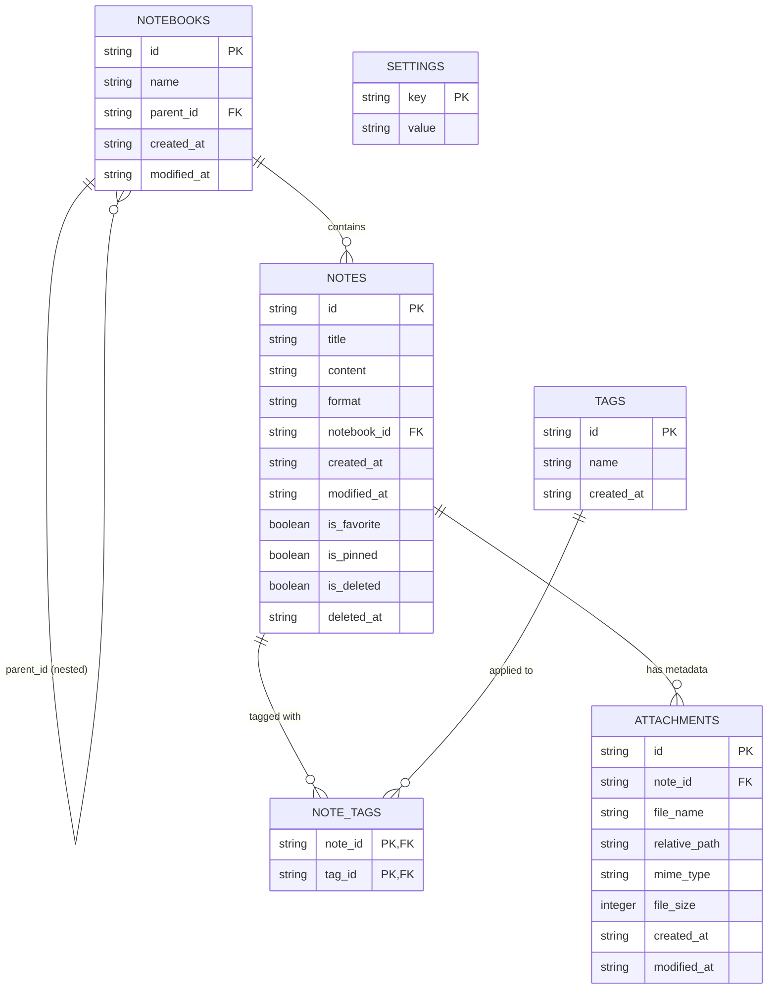

# Personal Notepad — Storage Architecture Design

This document defines the storage boundaries, component responsibilities, entity relationships, security principles, and cross-platform abstractions for the local-first storage foundation of **Personal Notepad**.

---

## 1. High-Level Architectural Flow

```text
React 19 / TypeScript UI
          │
          ▼
Frontend Storage Service (`src/services/storage/`)
          │
          ▼
Tauri IPC Commands (`invoke`)
          │
          ▼
Rust Application Layer (`src-tauri/src/commands/`)
          │
          ▼
Rust Repository & Storage Layer (`src-tauri/src/storage/`)
          │
          ├─────────────────────────┐
          ▼                         ▼
   SQLite Database          Filesystem Directories
  (`database.sqlite`)     (`attachments/`, `backups/`, `config/`)
```

---

## 2. Layer Responsibilities & Strict Boundaries

### 2.1 React / Presentation Layer (`src/`)
**Responsibilities**:
- Render views, layouts, and components.
- Capture user inputs and UI interactions.
- Manage local UI component state (modal open/close, active tab, active selection).
- Invoke clean methods exposed by the Frontend Storage Service.

**Strict Boundaries (What React Must NOT Do)**:
- ❌ React must NEVER execute raw SQL queries.
- ❌ React must NEVER know the underlying SQLite file paths or OS filesystem paths.
- ❌ React must NEVER manipulate the local database or filesystem directly.
- ❌ React must NEVER contain fallback browser database libraries (e.g. IndexedDB as shadow DB).

---

### 2.2 Frontend Storage Service (`src/services/storage/`)
**Responsibilities**:
- Provide strongly-typed TypeScript methods wrapping Tauri IPC (`invoke`).
- Validate input payloads before transmission across IPC.
- Transform backend responses into domain TypeScript interfaces (`Note`, `Notebook`, `Tag`, `Setting`).
- Translate backend error responses into user-friendly application errors.

**Conceptual Interface**:
```typescript
export interface StorageService {
  initialize(): Promise<StorageInfo>;
  notes: {
    list(filter?: NoteListFilter): Promise<Note[]>;
    get(id: string): Promise<Note | null>;
    create(input: CreateNoteInput): Promise<Note>;
    update(id: string, input: UpdateNoteInput): Promise<Note>;
    delete(id: string): Promise<boolean>;
  };
  notebooks: {
    list(): Promise<Notebook[]>;
    create(input: CreateNotebookInput): Promise<Notebook>;
    get(id: string): Promise<Notebook | null>;
  };
  tags: {
    list(): Promise<Tag[]>;
    create(name: string): Promise<Tag>;
  };
  settings: {
    get(key: string): Promise<string | null>;
    set(key: string, value: string): Promise<void>;
  };
}
```

---

### 2.3 Tauri IPC Layer (`commands/`)
**Responsibilities**:
- Serve as the security boundary between the untrusted webview and native OS code.
- Provide explicit, single-purpose command handlers (e.g. `create_note`, `list_notes`, `get_setting`).
- Validate arguments strictly before passing them to the Rust storage layer.
- Return structured `Result<T, StorageError>` responses to the frontend.

**Strict Boundary**:
- ❌ Never expose a generic `execute_sql(query)` command.

---

### 2.4 Rust Application & Repository Layer (`src-tauri/src/storage/`)
**Responsibilities**:
- Manage SQLite connection pool and connection lifecycle.
- Execute database migrations sequentially on application startup.
- Encapsulate all SQL queries inside domain repositories (`notes.rs`, `notebooks.rs`, `tags.rs`, `settings.rs`).
- Guarantee 100% parameterized SQL execution.
- Manage database transactions for multi-table atomic operations.
- Map raw database rows to Rust domain models (`Note`, `Notebook`, `Tag`, `Attachment`, `Setting`).

---

### 2.5 Filesystem Layer & Path Abstraction
**Responsibilities**:
- Determine the platform-appropriate application data directory via Tauri/OS APIs:
  - **Linux**: `$XDG_DATA_HOME/com.personalnotepad.app` (typically `~/.local/share/com.personalnotepad.app`)
  - **Windows (Future)**: `%APPDATA%\com.personalnotepad.app`
- Create and maintain the application directory structure idempotently:
  ```text
  Personal Notepad/
  ├── database.sqlite
  ├── attachments/
  │   └── <future note-id folders>/
  ├── backups/
  └── config/
  ```
- Reject path traversal attempts (`../`, absolute paths outside the designated data root).

---

## 3. Database Entities & Relationships



### Entity Summary:
1. **`notes`**: Stores note metadata and content (`format` = `"txt"` or `"md"`). Supports soft deletion flags (`is_deleted`, `deleted_at`) for future Trash capabilities.
2. **`notebooks`**: Stores organizational folders supporting nested hierarchy through self-referential `parent_id`.
3. **`tags`**: Unique tag labels with Unicode support.
4. **`note_tags`**: Many-to-many junction table with composite primary key `(note_id, tag_id)`.
5. **`attachments`**: Stores file metadata; binary contents are stored on the filesystem under `attachments/<note-id>/`.
6. **`settings`**: Key-value pair storage for persistent preferences (e.g. `theme`).

---

## 4. Timestamps & Formatting Rules
- All timestamps stored in SQLite are UTC ISO-8601 strings (e.g. `2026-09-29T16:54:00Z`).
- Avoid mixing local time, unix epoch seconds, and pre-formatted strings in the database.
- Time conversions to local display strings take place strictly at the presentation layer.

---

## 5. Security & Safety Principles
1. **Parameterized Queries**: Every variable parameter is bound using SQL placeholders (`?` or `$1`). String concatenation into SQL queries is strictly prohibited.
2. **Atomic Writes**: Multi-table operations (such as note creation with tags) run inside a transaction; failures trigger automatic rollback.
3. **Foreign Key Enforcement**: `PRAGMA foreign_keys = ON;` is enabled on every SQLite connection.
4. **Idempotent Migrations**: Database versioning table (`_migrations`) tracks executed migrations so schema updates run once and preserve all existing data.
5. **Zero Cloud / Local-First**: No remote database connections, cloud synchronization, telemetry, or third-party AI APIs exist in the application.
